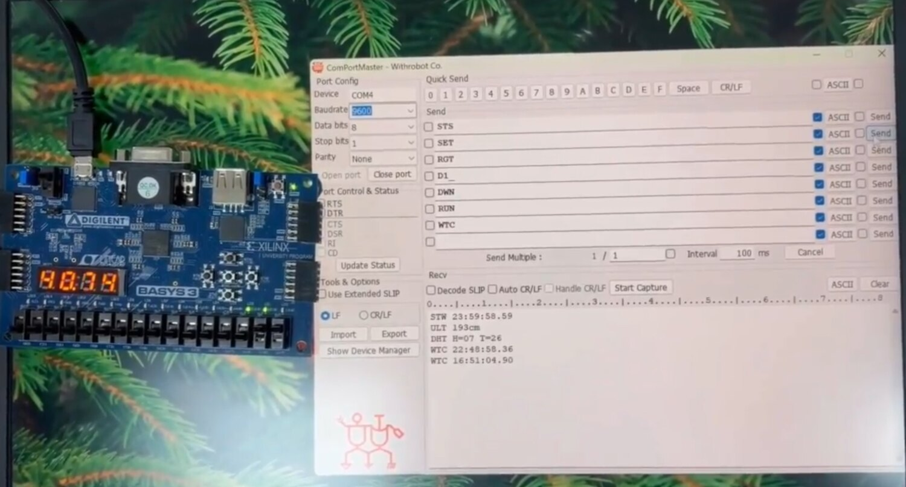
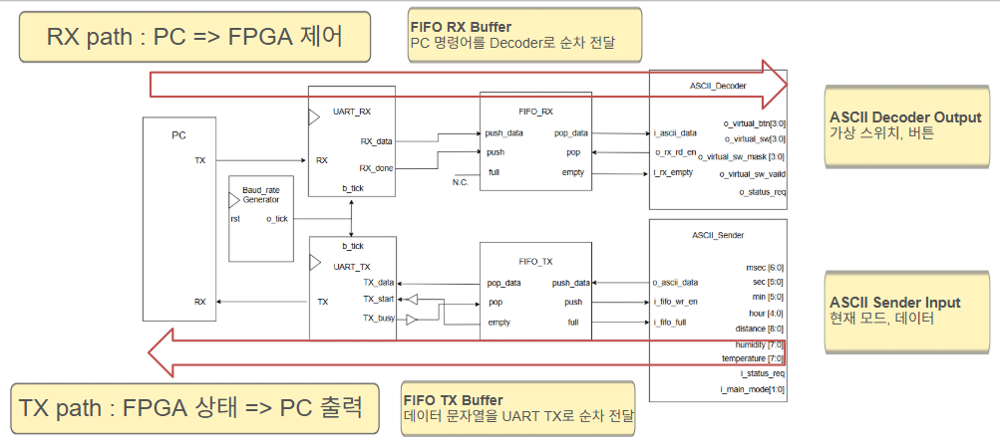
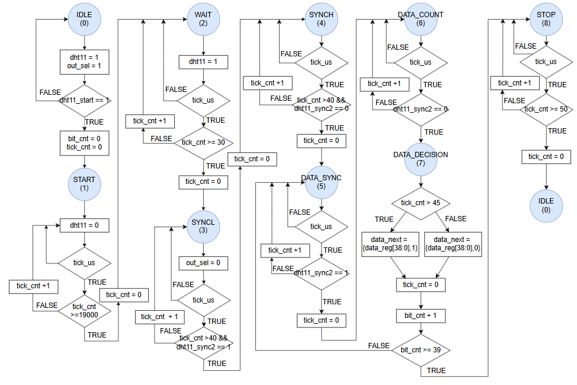
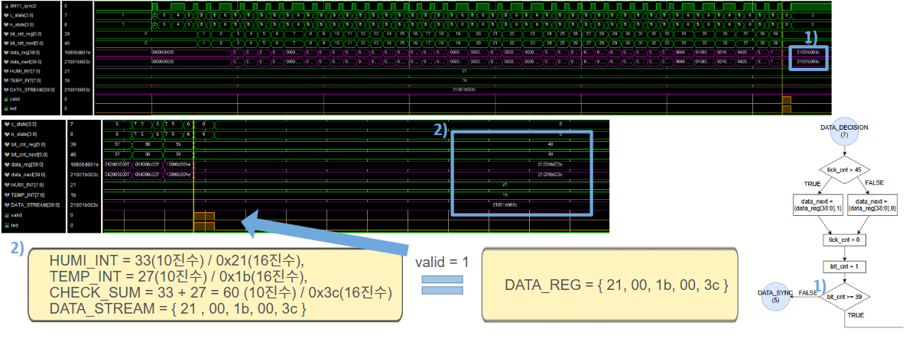
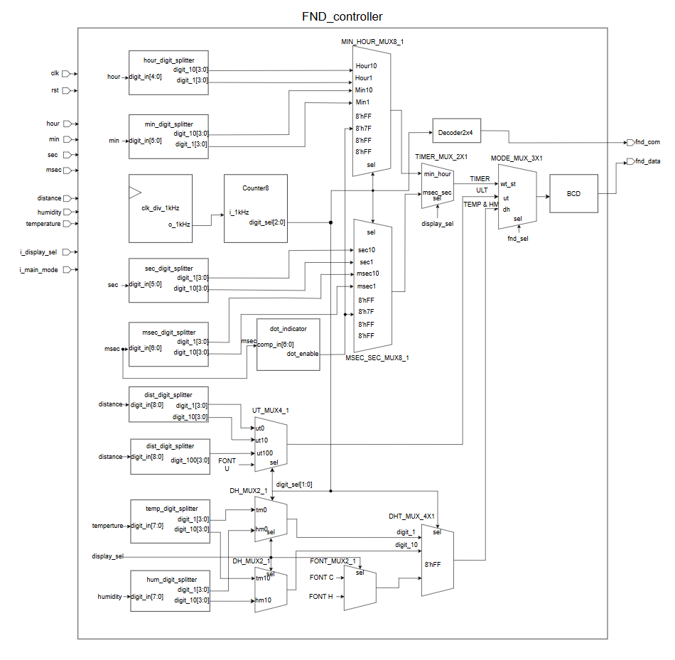
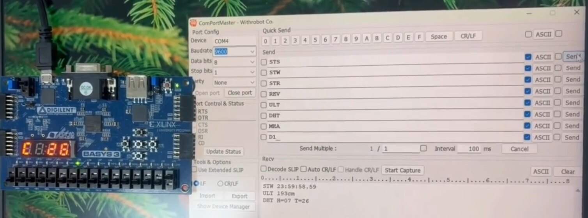

# PC-UART 기반 FPGA 통합 제어 시스템

PC에서 전송한 ASCII 명령어로 FPGA의 Stopwatch, Watch, 초음파 센서, 온습도 센서 기능을 제어하고, 측정 결과를 다시 PC로 전송하는 시스템입니다. UART와 FIFO를 직접 설계하여 송수신 경로를 구성했으며, DHT11 센서 컨트롤러와 FND 출력 제어를 중심으로 구현했습니다.

## 프로젝트 개요

- 개발 기간: 2026.05.01 ~ 2026.05.06
- 설계 언어: Verilog HDL
- FPGA 보드: Basys3 (Artix-7 XC7A35T)
- 개발 환경: Xilinx Vivado, Vivado Simulator
- UART 설정: 9600 bps, 8-N-1, LSB First, 16x Oversampling
- 주요 구성: UART RX/TX, RX/TX FIFO, ASCII Decoder/Sender, Stopwatch, Watch, HC-SR04, DHT11, FND Controller

## 핵심 구현

### DHT11 센서 제어

- Single-wire 통신 순서를 FSM으로 설계
- 40bit 데이터 수신 후 습도, 온도, 체크섬 분리
- HIGH 구간의 길이를 기준으로 0과 1 판별
- 체크섬이 일치할 때만 valid 신호 발생
- 수신 중 표시값이 흔들리지 않도록 출력 레지스터를 분리하고 valid 시점에만 갱신

### FND 출력 제어

- Stopwatch, Watch, 거리, 온습도 데이터를 하나의 4자리 FND로 표시
- 모드와 표시 선택 신호에 따라 출력 데이터를 선택하는 MUX 구조 설계
- BCD 변환과 다이나믹 스캔 방식으로 각 자릿수 출력
- 온도와 습도 표시를 구분할 수 있도록 H/C 문자 패턴 적용

### UART 기반 통합 제어

- PC 명령을 UART RX와 RX FIFO를 통해 수신
- ASCII Decoder가 3문자 명령을 해석하여 가상 스위치·버튼 신호 생성
- 물리 입력과 PC 입력은 변경된 비트만 반영하는 Bit Masking 방식으로 병합
- 현재 모드와 센서값은 ASCII 문자열로 변환한 뒤 TX FIFO와 UART TX를 통해 PC로 송신

## 시스템 구조

PC에서 보낸 명령은 UART RX → RX FIFO → ASCII Decoder 순서로 전달됩니다. 반대 방향에서는 ASCII Sender가 현재 상태를 문자열로 만들고 TX FIFO → UART TX 순서로 PC에 전송합니다. FIFO를 사용해 UART의 전송 시간과 내부 제어 로직의 처리 시간을 분리했습니다.

## 동작 모드와 명령어

- STW: Stopwatch 모드 선택
- WTC: Watch 모드 선택
- ULT: HC-SR04 거리 측정 모드 선택
- DHT: DHT11 온습도 측정 모드 선택
- STS: 현재 모드와 측정값 요청
- STR / PAU / CLR: Stopwatch 시작, 일시정지, 초기화
- TRG / MEA: 센서 측정 동작 제어

## DHT11 설계 및 검증

DHT11의 시작 신호, 센서 응답, 40bit 데이터 수신, 체크섬 확인 과정을 상태별로 나누어 제어했습니다. 수신 데이터는 습도 33%, 온도 27°C, 체크섬 60 조건으로 검증했으며, 합산값과 체크섬이 일치할 때 valid가 정상적으로 발생하는 것을 확인했습니다.

## FND 출력 구조

모드별 데이터를 공통 FND 출력부에 연결하고, 자릿수 선택 신호에 따라 Stopwatch/Watch 시간, 거리, 온도, 습도를 표시하도록 구성했습니다.

## FPGA 동작 결과

PC 터미널에서 명령을 전송했을 때 FPGA 모드가 전환되고, FND 표시값과 UART 응답값이 함께 갱신되는 것을 확인했습니다.

- UART Baud Tick 약 6.51 μs 확인
- UART RX/TX 8-N-1 송수신 확인
- FIFO Full/Empty 및 데이터 순서 보존 확인
- HC-SR04 Echo 1,000 μs 입력에서 약 17.24 cm 출력 확인
- DHT11 40bit 수신 및 체크섬 PASS/FAIL 확인
- 합성 후 Timing Constraint 충족

## 소스 구성

- rtl/TOP.v: 전체 모듈 연결 및 입출력 구성
- rtl/uart.v: UART RX, UART TX, Baud Tick Generator
- rtl/fifo.v: RX/TX 데이터 버퍼
- rtl/ASCII_decoder.v: PC 명령어 해석
- rtl/ASCII_sender.v: FPGA 상태값의 ASCII 문자열 변환
- rtl/dht11.v: DHT11 통신 및 체크섬 검증
- rtl/sr04.v: HC-SR04 Trigger/Echo 제어 및 거리 계산
- rtl/fnd_controller.v: 모드별 FND 출력 제어
- rtl/top_stopwatch_watch.v: Stopwatch와 Watch 통합
- rtl/system_control_unit.v: 모드 선택 및 제어 신호 분배

## 프로젝트 문서

- [완료보고서](docs/project_report.docx)
- [발표자료](docs/project_presentation.pptx)
- [프로젝트 일정표](docs/project_schedule.xlsx)
- [2026.05.01 ~ 2026.05.06 작업 일지](docs/daily/)
